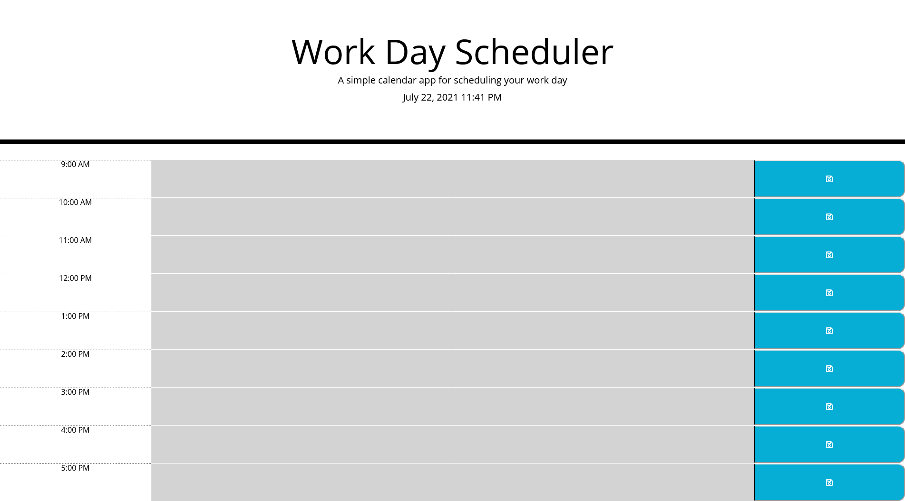
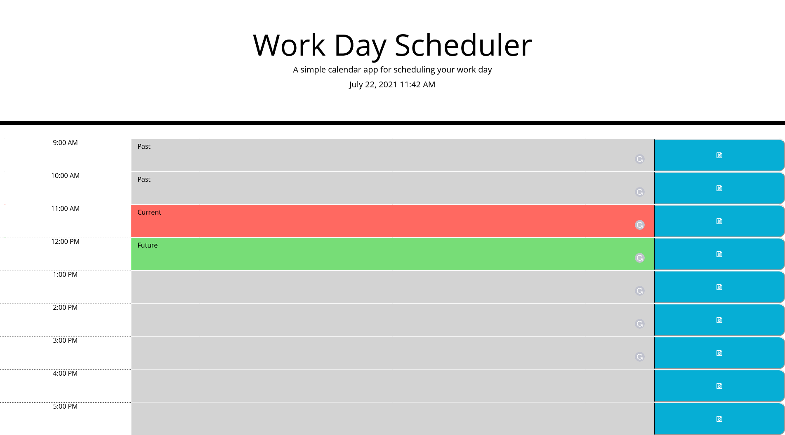

# Work Day Scheduler Challenge

## Description
A nine to five work day scheduler. Pick your time of day and jot down your tasks! Includes a save function and color code. Simply delete decription area and save again. Grayed out boxes are past events. Red is the present time. Green is for future/upcoming.

## Web Link
[Start your planning now!](https://lightfooted.github.io/work-day-scheduler/)

## Screenshot

Empty

Filled and highlighted

### Additional Notes
On Windows: To test right click on your clock, go to Adjust date/time, turn off auto time, manually set desired time and play with the scheduler. Revert back to original settings when done.

## Construction
Completed by Kimberly Collazo